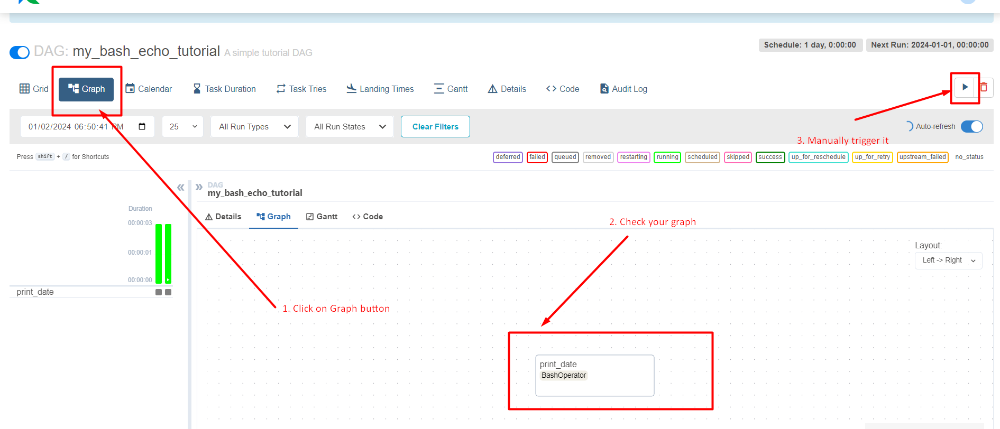

# Airflow tutorial

Work with airflow can be challenging. This tutorial will guide you through everyday routine of Airflow engineer through task of OCR recognition of book.

## Intro
Airflow is orchestration tool. It means it capable of: 
- connecting all odd task together 
- advising a way for transferring data between tasks
- scheduling execution on timetable
- providing best effort to fix errors

## Technical prerequisits. 
Unfortunately, you'll need at least **4GB of RAM** on your desktop for running Airflow. I hope you'll find a way to cope with it.

## Plan


###

You'll need to install Docker on your work machine. I'll provide you a small guide on steps for installation for your os.


<details>
<summary>Guide</summary>
<div><ul>
    <li> Linux
        <div>       
        Follow steps of <a href="https://docs.docker.com/engine/install/ubuntu/">official Docker Guide</a>. It's free :)
        </div>
    </li>
    <li> Windows
        <ul> 
            <li> If you already have WSL2
                <div> 
                Then you can proceed with similar steps for Linux.
                You can modify RAM for wsl with <a href="https://learn.microsoft.com/en-us/answers/questions/1296124/how-to-increase-memory-and-cpu-limits-for-wsl2-win">question</a> from official Microsoft forum.
                </div>
            </li>    
            <li> If you don't have WSL2
                <div>
                Install WSL2. Follow <a href="https://learn.microsoft.com/en-us/windows/wsl/install">official Microsoft guide</a>. I recommend use to choose Ubuntu 20.04 as your unix system. 
                </div>
            </li>
        </ul>
    </li>
</ul></div>
</details>

## Installing Airflow from Docker 

We will work with Docker version of Airflow as it's allows to make reproducible environment. I'll follow [official Airflow instruction]( https://airflow.apache.org/docs/apache-airflow/stable/howto/docker-compose/index.html) for running in Docker.

Here's step by step instruction of running airflow
- Create folders for 
    ```bash
    mkdir -p ./dags ./logs ./plugins ./config
    ```
    Here's concrete:
    

    <details>
    <summary>In case you want to delete them use</summary>
    sudo rm -r  ./dags ./logs ./plugins ./config
    </details>
- Set unique id of airflow process
    ```bash
    echo -e "AIRFLOW_UID=$(id -u)" > .env
    ```
- Initialize Airflow
    ```bash
    docker compose up airflow-init
    ```
- Finally you can enjoy Airflow
    ```bash
    docker compose up
    ```
    If everything gone well, you can visit Airflow website on address http://localhost:8080/home. Password will be 
    
- Now you can close Airflow by `Ctrl+C` in terminal. It will gracefully shut down.

Informal description of created folders
- `dags/` - folder where you'll store your  
- `logs/` - holds journal of changes and executions of your scripts
- `plugins/` - allow to modify airflow. More info [here](https://airflow.apache.org/docs/apache-airflow/stable/authoring-and-scheduling/plugins.html)
- `/config` -  

Hopefully we will be interested only in `dags` folder in this tutorial.


### Toy dag development


After successful installation we can start writing our pipelines. We'll add them in directory dags

- We'll start by running airflow
    ```bash
    docker compose up
    ```
- Then we'll add a file `hello.py` to `dags/` folder. Copy following code.
    ```python
    from airflow.models.dag import DAG
    from datetime import datetime, timedelta
    from airflow.models.dag import DAG
    from airflow.operators.bash import BashOperator

    with DAG(
        "my_bash_echo_tutorial",
        default_args={
            "retries":21,
            "retry_delay": timedelta(minutes=5),
        },
        description="A simple tutorial DAG",
        schedule=timedelta(days=1),
        start_date=datetime(2021, 1, 1),
        catchup=False,
        tags=["example"],
    ) as dag:

        t1 = BashOperator(
            task_id="create_hello.txt",
            bash_command="touch hello.txt",
        )

        t2 = BashOperator(
            task_id="fill_hello.txt",
            bash_command="echo 'hello Airflow' << hello.txt",
        )

        t1 << t2
    ```

- Wait around 15 seconds before airflow will parse your new dag
   
    Dags are uploaded and updated in runtime of Airflow. It means you don't need to restart anything to update results, just make correction, save file and wait small time to see updates.

    Let's find our new dag:
    `my_bash_echo_tutorial`

    


    IF some errors happend Airflow will let you know
    
- You can run it from UI
    
    Trigger it pressing button in upper right corner. This will manually run dag.
- Let's look on execution. 
    

So now it's your turn to experiment using Airflow documentation. I ask you to

3. Actual task


```
!wget https://mathus.ru/math/geometric-progression.pdf
```